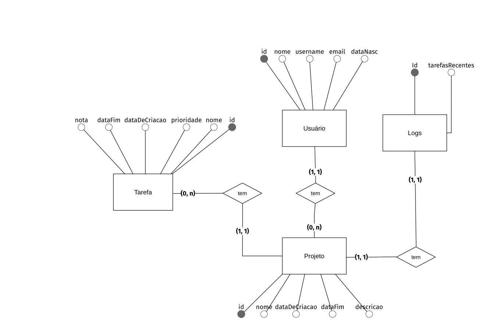

# Documento de Modelos

Neste documento foi utilizado o modelo de dados Entidade-Relacionamento, descrevendo também as entidades e finalizando com o dicionário de dados.

## Modelo de Dados (Entidade-Relacionamento) 

Modelo dados usando o **BrModelo**.
## 

## Descrição das Entidades

Abaixo temos uma breve descrição das entidades que compõe o sistema.

| Entidade | Descrição   |
|----------|------------------------------------------------------------------------------------------------------------------------------------------------------|
| Tarefa   | A entidade tarefas possui diversos atributos em sua composição, dentre eles temos os atributos de dataDeCriacao e dataFim, esses podem definir o período que uma tarefa está disponível, existe também o atributo de prioridade, onde é definido as tarefas que possuem um grau de prioridade maior que as outras, também possui o atributo nota, que é usado para deixar observações ou lembretes em uma tarefa.                                     |
| Projeto     | A entidade projeto possui a finalidade de termos diversas tarefas coorelacionadas para que ocorra uma organização maior quando se trata de diversas tarefas que são do mesmo projeto. |
| Usuário   | A entidade usuário é usada para armazenar os dados pessoais e gerenciar seus projetos e tarefas que são atribuídos ao mesmo.                                              |
| Logs   | A entidade Logs possui a principal finalidade de obter relatórios de tarefas e projetos que finalizados em um determinado período de tempo.                                                              |

## Dicionário de Dados

O dicionário de dados consiste em um conjunto de tabelas que fornecem informações sobre outras tabelas no banco de dados. Dessa forma, o dicionário de dados configura-se como um repositório de metadados, armazenado em um banco de dados relacional, descrevendo e mapeando as estruturas de dados do sistema.

## Tabela - Usuário

| Atributo  | Chave | Tipo de dado | Tamanho | Descrição                                     |
| --------- | :---: | :----------: | :-----: | --------------------------------------------- |
| id        |  PK   |   NUMERIC    |    4    | Identificador incremental de usuário.         |
| nome      |  NN   | VARCHAR[100] |   100   | Nome real do usuário.                         |
| username  |  NN   | VARCHAR[16]  |   16    | Nome do usuário no sistema.                   |
| dataNasc  |  NN   |     DATE     |    3    | Data formato (XX-XX-XXXX).                    |
| email     |  NN   | VARCHAR[256] |   256   | Email utilizado pelo usuário.                 |

## Tabela - Projeto

| Atributo     | Chave | Tipo de dado | Tamanho | Descrição                                      |
| ------------ | :---: | :----------: | :-----: | ---------------------------------------------- |
| id           |  PK   |   NUMERIC    |    4    | Identificador incremental de projeto.          |
| nome         |  NN   | VARCHAR[100] |   100   | Nome do projeto.                               |
| descricao    |  NN   | VARCHAR[280] |   280   | Descrição do projeto.                          |
| dataDeCriacao|  NN   |     DATE     |    3    | Data formato (XX-XX-XXXX).                     |
| dataFim      |  NN   |     DATE     |    3    | Data formato (XX-XX-XXXX).                     |
| user_id      |  FK   |   NUMERIC    |    4    | Chave para um usuário.                         |

## Tabela - Tarefa

| Atributo     | Chave | Tipo de dado |  Tamanho  | Descrição                                                             |
| ------------ | :---: | :----------: | :-------: | --------------------------------------------------------------------- |
| id           |  PK   |   NUMERIC    |     4     | Identificador incremental de tarefa.                                  |
| nome         |  NN   | VARCHAR[50]  |    50     | Nome do projeto.                                                      |
| nota         |  NN   |  VARCHAR[]   | Undefined | Lembrete ou observação que pode ou não ser adicionado a uma tarefa.   |
| prioridade   |  NN   |   NUMERIC    |     4     | Prioridade da tarefa.                                                 |
| dataDeCriacao|  NN   |   DATETIME   |     8     | Data e hora formato (YYYY-MM-DD HH:MM:SS.ffffff).                     |
| dataFim      |  NN   |   DATETIME   |     8     | Data e hora formato (YYYY-MM-DD HH:MM:SS.ffffff).                     |
|tarefa_projeto|  FK   |   NUMERIC    |     4     | Chave para um projeto.                                                |

## Tabela - Logs

| Atributo    | Chave | Tipo de dado | Tamanho | Descrição                                                           |
| ----------- | :---: | :----------: | :-----: | ------------------------------------------------------------------- |
| id          |  PK   |   NUMERIC    |    4    | Identificador incremental de Lembrete.                              |
| tarefasRecentes    |  NN   | VARCHAR[]  |   Undefined    | Histórico de tarefas já realizadas.                     |
