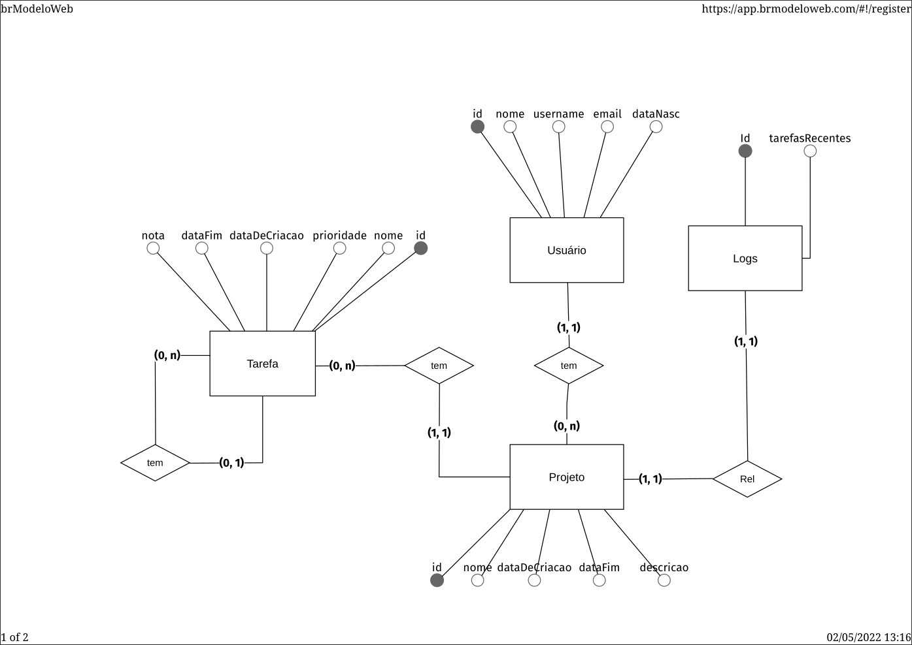

# Documento de Modelos

Neste documento foi utilizado o modelo de dados Entidade-Relacionamento, descrevendo também as entidades e finalizando com o dicionário de dados.

## Modelo de Dados (Entidade-Relacionamento) 

Modelo dados usando o **BrModelo**.
## 

## Descrição das Entidades

Abaixo temos uma breve descrição das entidades que compõe o sistema.